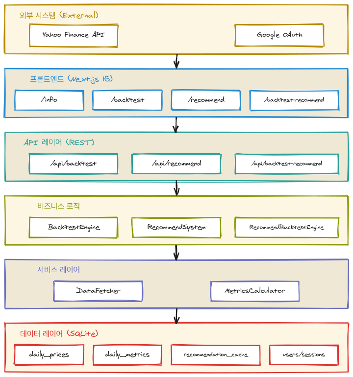

# 떨사오팔 Pro (Buy Dip Sell Peak Pro)

3배 레버리지 ETF(SOXL, TQQQ) 트레이딩 전략을 위한 CLI 기반 백테스팅 및 데이터 관리 시스템

- **떨사오팔 전략**: 떨어지면 사고, 오르면 파는 분할 매수/매도 전략
- **백테스트 엔진**: Pro1/Pro2/Pro3 전략의 과거 성과 시뮬레이션
- **전략 추천 시스템**: 기술적 지표 기반 유사 구간 분석으로 최적 전략 추천
- **트레이딩 계좌 관리**: 티어 기반 LOC/MOC 주문 및 손절 처리

---

## 목차

- [빠른 시작](#빠른-시작)
- [핵심 개념](#핵심-개념)
- [사용 가이드](#사용-가이드)
- [시스템 아키텍처](#시스템-아키텍처)
- [상세 기능 문서](#상세-기능-문서)
- [개발 가이드](#개발-가이드)
- [라이선스](#라이선스)

---

## 빠른 시작

### 1. 설치

```bash
npm install
```

### 2. 데이터 초기화

```bash
npm run dev init-all
```

모든 티커(SOXL, TQQQ)의 전체 히스토리를 다운로드하고 기술적 지표를 계산합니다.

### 3. 웹 개발 서버 실행

```bash
npm run web:dev
```

http://localhost:3000 에서 웹 UI에 접속할 수 있습니다.

---

## 핵심 개념

### 떨사오팔 전략

"떨어지면 사고, 오르면 파는" 분할 매수/매도 전략입니다.

- **티어 고정 방식**: 7개 티어(1~6 + 예비티어7)로 자금을 분할
- **순차적 매수**: 가장 낮은 빈 티어부터 순서대로 매수 (티어1 → 티어2 → ...)
- **사이클**: 매수 시작부터 보유 티어 전량 매도까지의 한 주기
- **손절**: 손절일 도달 시 MOC 주문으로 보유 티어 전량 매도

### Pro 전략 비교

| 전략 | 티어 비율 | 매수 기준 | 매도 기준 | 손절일 |
|------|----------|----------|----------|--------|
| Pro1 | 5%, 10%, 15%, 20%, 25%, 25% | -0.01% | +0.01% | 10일 |
| Pro2 | 10%, 15%, 20%, 25%, 20%, 10% | -0.01% | +1.50% | 10일 |
| Pro3 | 16.7% × 6 | -0.10% | +2.00% | 12일 |

### 지원 티커

| 티커 | 설명 | 상장일 |
|------|------|--------|
| SOXL | Direxion Daily Semiconductor Bull 3X Shares | 2010-03-11 |
| TQQQ | ProShares UltraPro QQQ | 2010-02-09 |

---

## 사용 가이드

### CLI 명령어

| 명령어 | 설명 |
|--------|------|
| `init` | 데이터베이스 초기화 및 전체 히스토리 다운로드 (지표 포함) |
| `init-all` | 모든 티커의 전체 히스토리 다운로드 (지표 포함) |
| `update` | 최신 데이터로 업데이트 (증분, 지표 포함) |
| `update-all` | 모든 티커 업데이트 (지표 포함) |
| `init-metrics` | 기존 가격 데이터로 기술적 지표 일괄 계산 |
| `verify-metrics` | 지표 계산 결과 검증 |
| `query` | 데이터 조회 |
| `help` | 도움말 표시 |

#### 명령어 예시

```bash
# 단일 티커 초기화
npm run dev init -- --ticker SOXL

# 모든 티커 업데이트
npm run dev update-all

# 데이터 조회
npm run dev query -- --ticker SOXL --start 2025-01-01 --end 2025-12-31

# 추천 전략 사전 계산
npx tsx scripts/precompute-recommendations.ts
```

#### 명령어 옵션

| 옵션 | 설명 | 기본값 |
|------|------|--------|
| `--ticker` | 티커 심볼 (SOXL, TQQQ) | SOXL |
| `--start` | 조회 시작일 (YYYY-MM-DD) | - |
| `--end` | 조회 종료일 (YYYY-MM-DD) | - |

### 웹 UI 페이지

| 페이지 | 경로 | 설명 |
|--------|------|------|
| Info | `/info` | 서비스 소개 및 전략 설명 |
| Backtest | `/backtest` | 백테스트 결과 시각화 |
| Recommend | `/recommend` | 전략 추천 분석 |
| Backtest Recommend | `/backtest-recommend` | 추천 전략 백테스트 |
| Trading | `/trading` | 트레이딩 계좌 목록 |
| MyPage | `/mypage` | 프로필 및 회원 탈퇴 |

### REST API 엔드포인트

| 메서드 | 엔드포인트 | 설명 | 인증 |
|--------|-----------|------|------|
| POST | `/api/backtest` | 백테스트 실행 | 필요 |
| POST | `/api/recommend` | 전략 추천 | 필요 |
| POST | `/api/backtest-recommend` | 추천 전략 백테스트 | 필요 |
| DELETE | `/api/user/delete` | 회원 탈퇴 | 필요 |
| GET/POST | `/api/trading/accounts` | 계좌 CRUD | 필요 |
| GET | `/api/trading/accounts/[id]/holdings` | 티어 보유현황 | 필요 |
| GET/POST | `/api/trading/accounts/[id]/orders` | 당일 주문 | 필요 |

---

## 시스템 아키텍처



<details>
<summary>레이어별 설명</summary>

| 레이어 | 구성요소 | 역할 |
|--------|----------|------|
| 외부 시스템 | Yahoo Finance, Google OAuth | 데이터 소스, 인증 제공 |
| 프론트엔드 | Next.js 15 페이지 5개 | 사용자 인터페이스 |
| API | REST 엔드포인트 3개 | 비즈니스 로직 접근점 |
| 비즈니스 로직 | 백테스트/추천 엔진 | 핵심 알고리즘 |
| 서비스 | DataFetcher, MetricsCalculator | 데이터 수집/가공 |
| 데이터 | SQLite 테이블 4종 | 영속성 |

</details>

### 프로젝트 구조

```
scripts/
└── precompute-recommendations.ts    # 추천 전략 사전 계산 스크립트

src/
├── index.ts                         # CLI 진입점 - 8개 명령어 핸들링
├── auth.ts                          # NextAuth.js 설정 (providers, adapter)
├── types/
│   ├── index.ts                     # TypeScript 인터페이스 (DailyPrice, QueryOptions, Command)
│   └── trading.ts                   # 트레이딩 타입 정의 (계좌, 티어, 주문, 전략 상수)
├── database/
│   ├── index.ts                     # SQLite 연결 관리 및 CRUD 작업 (싱글톤 패턴, 추천 캐시 포함)
│   ├── schema.ts                    # daily_prices, daily_metrics, recommendation_cache 테이블 스키마
│   └── trading.ts                   # 트레이딩 CRUD 및 주문 생성/체결 로직
├── services/
│   ├── dataFetcher.ts               # Yahoo Finance API 연동 (재시도 로직 포함)
│   └── metricsCalculator.ts         # 배치 기술적 지표 계산 (슬라이딩 윈도우 최적화)
├── backtest/
│   ├── engine.ts                    # 백테스트 엔진 메인 클래스
│   ├── trading-utils.ts             # 공유 거래 유틸리티 (매수/매도/손절/스냅샷)
│   ├── strategy.ts                  # 전략 매개변수 정의 (Pro1/Pro2/Pro3)
│   ├── cycle.ts                     # 사이클 상태 관리
│   ├── order.ts                     # LOC/MOC 주문 계산
│   ├── metrics.ts                   # 성과 지표 계산
│   ├── types.ts                     # 백테스트 전용 타입 + STRATEGY_COLORS 상수
│   └── index.ts                     # 모듈 엔트리포인트
├── recommend/
│   ├── types.ts                     # 추천 관련 타입 정의
│   ├── similarity.ts                # 코사인 유사도 계산
│   ├── score.ts                     # 전략 점수 계산
│   └── index.ts                     # 모듈 엔트리포인트
├── backtest-recommend/
│   ├── engine.ts                    # 추천 전략 백테스트 엔진
│   ├── recommend-helper.ts          # 빠른 전략 추천 헬퍼
│   ├── types.ts                     # 추천 백테스트 전용 타입
│   └── index.ts                     # 모듈 엔트리포인트
├── utils/
│   └── trading-core.ts              # 공통 트레이딩 유틸리티 (가격 계산, 체결 판정)
├── lib/
│   ├── date.ts                      # 날짜 유틸리티 함수
│   ├── auth/
│   │   └── api-auth.ts              # API 인증 유틸리티 (requireAuth, isUnauthorized)
│   └── validations/
│       └── trading.ts               # 트레이딩 입력값 검증 스키마 (Zod)
├── components/
│   ├── TopControlBar.tsx            # 상단 컨트롤 바
│   ├── MainNavigation.tsx           # 메인 네비게이션
│   ├── Sidebar.tsx                  # 우측 사이드바 (최근 주가 SOXL/TQQQ - DB 연동)
│   ├── StrategyCard.tsx             # 전략 카드 (Pro1/Pro2/Pro3)
│   ├── FlowChart.tsx                # 사용법 플로우차트
│   ├── PremiumModal.tsx             # 프리미엄 모달
│   ├── backtest/                    # 백테스트 시각화 컴포넌트
│   ├── recommend/                   # 전략 추천 시각화 컴포넌트
│   ├── backtest-recommend/          # 추천 백테스트 시각화 컴포넌트
│   ├── trading/                     # 트레이딩 컴포넌트
│   └── mypage/                      # 마이페이지 컴포넌트
├── styles/
│   └── globals.css                  # 글로벌 스타일 + 커스텀 CSS
└── app/                             # Next.js App Router 페이지
    ├── layout.tsx                   # 루트 레이아웃 (CDN, 메타데이터)
    ├── page.tsx                     # 홈페이지 (/ → /info 리다이렉트)
    ├── info/page.tsx                # Info 페이지 (전략 설명)
    ├── backtest/                    # Backtest 페이지
    ├── recommend/                   # Recommend 페이지
    ├── backtest-recommend/          # 추천 전략 백테스트 페이지
    ├── trading/                     # 트레이딩 페이지
    ├── mypage/                      # 마이페이지
    └── api/                         # API 라우트
        ├── auth/[...nextauth]/      # NextAuth.js API 라우트
        ├── backtest/                # 백테스트 API
        ├── recommend/               # 추천 API
        ├── backtest-recommend/      # 추천 백테스트 API
        ├── trading/                 # 트레이딩 API
        └── user/                    # 사용자 API
```

### 기술 스택

| 항목 | 기술 | 비고 |
|------|------|------|
| 런타임 | Node.js (ESM) | - |
| 언어 | TypeScript (strict 모드) | - |
| 프레임워크 | Next.js 15 (App Router) | React 19 |
| 데이터베이스 | SQLite (WAL 모드) | better-sqlite3 |
| 데이터 소스 | Yahoo Finance API | yahoo-finance2 |
| CSS | Bootstrap 5.3.3 | Bootswatch Solar 테마 |
| 차트 | Recharts 3.6 | - |
| 인증 | NextAuth.js 5 (beta) | Google OAuth |
| 폰트 | Noto Sans KR | Google Fonts |

### 데이터 흐름

```
Yahoo Finance API → dataFetcher (재시도/파싱) → database (트랜잭션) → SQLite (prices.db)
```

---

## 상세 기능 문서

### 백테스트 엔진

<details>
<summary>상세 보기</summary>

떨사오팔 Pro 전략의 과거 성과를 시뮬레이션하는 백테스트 엔진입니다.

#### 핵심 기능

- **LOC 주문**: 전일 종가 기준 매수/매도 지정가 계산
- **티어 관리**: 6개 기본 티어 + 1개 예비 티어
- **풀복리**: 사이클 종료 시 수익/손실 반영하여 다음 사이클 투자금 재계산
- **손절 처리**: 손절일 도달 시 MOC 주문으로 전량 청산
- **성과 지표**: 최종 자산, 수익률, MDD, 승률 계산
- **기술적 지표**: 6개 핵심 지표 자동 계산 (MA20/60, RSI, ROC, 변동성 등)

#### 기술적 지표 (SPEC-METRICS-001)

| 지표 | 필드명 | 설명 |
|------|--------|------|
| 이동평균 | `ma20`, `ma60` | 20일/60일 단순이동평균 (DailySnapshot에 포함) |
| 정배열 | `goldenCross` | (MA20 - MA60) / MA60 × 100 (%) |
| MA 기울기 | `maSlope` | 10일간 MA20 변화율 (%) |
| 이격도 | `disparity` | (종가 - MA20) / MA20 × 100 (%) |
| RSI(14) | `rsi14` | Wilder's EMA 방식 (0-100) |
| ROC(12) | `roc12` | 12일 변화율 (%) |
| 변동성 | `volatility20` | 20일 표준편차 × √20 |

#### API 사용법

```typescript
import { runBacktest, STRATEGIES } from './backtest';

const result = await runBacktest({
  ticker: 'SOXL',
  strategy: 'Pro2',
  startDate: '2025-01-02',
  endDate: '2025-12-19',
  initialCapital: 10000,
});

console.log(`최종 자산: $${result.finalAsset.toFixed(2)}`);
console.log(`수익률: ${(result.returnRate * 100).toFixed(2)}%`);
console.log(`MDD: ${(result.mdd * 100).toFixed(2)}%`);

// 종료일 기준 기술적 지표
if (result.technicalMetrics) {
  console.log(`RSI(14): ${result.technicalMetrics.rsi14}`);
  console.log(`정배열: ${result.technicalMetrics.goldenCross}%`);
}

// 일별 이동평균
result.dailyHistory.forEach(day => {
  console.log(`${day.date}: MA20=${day.ma20}, MA60=${day.ma60}`);
});
```

#### REST API

**POST /api/backtest**

```json
{
  "ticker": "SOXL",
  "strategy": "Pro2",
  "startDate": "2025-01-02",
  "endDate": "2025-12-19",
  "initialCapital": 10000
}
```

#### 차트 컴포넌트

| 컴포넌트 | 설명 |
|----------|------|
| `PriceChart` | 종가 + MA20/MA60 라인 차트 (로그 스케일) |
| `MetricsCharts` | 6개 기술적 지표 미니 차트 (정배열, 기울기, 이격도, RSI, ROC, 변동성) |
| `ProResultCard` | 전략별 결과 카드 - 수익률, MDD, 자산 변동 차트 포함 |

</details>

### 전략 추천 시스템

<details>
<summary>상세 보기</summary>

과거 유사 구간을 분석하여 최적의 트레이딩 전략을 추천하는 시스템입니다. (SPEC-RECOMMEND-001)

#### 핵심 기능

- **기술적 지표 벡터**: 6개 지표(정배열, 기울기, 이격도, RSI, ROC, 변동성)로 시장 상태 표현
- **코사인 유사도**: 기준일과 과거 구간 간 유사도 계산
- **전략 점수 계산**: `점수 = 수익률(%) × e^(MDD(%) × 0.01)` 공식으로 위험 조정 수익률 산출
- **자동 추천**: Top 3 유사 구간의 백테스트 결과를 기반으로 최적 전략 추천

#### 전략 제외 규칙

- **Pro1**: 정배열(MA20 > MA60) 상태에서는 점수 비교에서 제외

#### 사용법

1. `/recommend` 페이지 접속
2. 기준일 선택 (오늘 기준 / 특정일)
3. 종목 선택 (SOXL / TQQQ)
4. "분석" 버튼 클릭

#### 분석 결과

| 항목 | 설명 |
|------|------|
| 기준일 차트 | 20일 분석 구간 + 미래 20일 영역 (회색) |
| 유사 구간 Top 3 | 유사도 순 정렬, 각 구간의 20일 + 성과 20일 차트 |
| 전략 점수 테이블 | Pro1/Pro2/Pro3 평균 점수 비교 |
| 추천 전략 | 최고 점수 전략 + 티어별 투자 비율 |

#### REST API

**POST /api/recommend**

```json
{
  "ticker": "SOXL",
  "referenceDate": "2026-01-20",
  "isToday": true
}
```

**Response:**

```json
{
  "success": true,
  "data": {
    "referenceDate": "2026-01-20",
    "ticker": "SOXL",
    "referenceMetrics": { ... },
    "similarPeriods": [...],
    "strategyScores": { ... },
    "recommendation": {
      "strategy": "Pro2",
      "tierRatios": [0.15, 0.15, 0.15, 0.15, 0.15, 0.25],
      "reason": "평균 점수 12.34로 가장 높음"
    }
  }
}
```

</details>

### 추천 전략 백테스트

<details>
<summary>상세 보기</summary>

사이클 경계에서 전략을 동적으로 전환하는 백테스트 시스템입니다. (SPEC-BACKTEST-RECOMMEND)

#### 핵심 기능

- **동적 전략 전환**: 각 사이클 시작 시 추천 시스템을 통해 최적 전략 선택
- **전략 사용 통계**: Pro1/Pro2/Pro3 각 전략의 사용 빈도 및 일수 추적
- **사이클별 상세 정보**: 각 사이클의 전략, RSI, 정배열 여부, 수익률 등 기록
- **추천 캐시 시스템**: 사전 계산된 추천 결과를 DB에 저장하여 백테스트 성능 최적화

#### 추천 캐시 사전 계산

백테스트 성능 향상을 위해 모든 날짜의 추천 결과를 사전 계산할 수 있습니다:

```bash
npx tsx scripts/precompute-recommendations.ts
```

- SOXL, TQQQ 모든 날짜에 대해 추천 전략 계산
- 배치 저장으로 DB I/O 최적화 (100개 단위)
- 진행률 표시 및 결과 요약 출력

#### 사용법

1. `/backtest-recommend` 페이지 접속
2. 시작일/종료일, 종목, 초기자본 입력
3. "실행" 버튼 클릭

#### REST API

**POST /api/backtest-recommend**

```json
{
  "ticker": "SOXL",
  "startDate": "2025-01-01",
  "endDate": "2025-12-31",
  "initialCapital": 10000
}
```

</details>

### 트레이딩 계좌 관리 시스템

<details>
<summary>상세 보기</summary>

떨사오팔 Pro 전략을 실제 매매에 적용하기 위한 트레이딩 계좌 관리 시스템입니다. (PRD-TRADING-001)

#### 핵심 기능

- **계좌 관리**: 트레이딩 계좌 생성, 조회, 수정, 삭제 (CRUD)
- **티어 고정 방식**: 7개 티어(1~6 + 예비티어7) 자동 생성 및 관리
- **당일 주문 자동 생성**: LOC(지정가) 매수/매도, MOC(시장가) 손절 주문
- **주문 체결 처리**: 종가 기준 체결 여부 판정 및 티어 업데이트
- **손절 처리**: 보유일 >= 손절일 시 MOC 주문으로 전량 청산
- **사이클 보호**: 사이클 진행 중 계좌 설정 변경 방지

#### 주문 유형

| 유형 | 설명 | 체결 조건 |
|------|------|----------|
| LOC 매수 | 지정가 매수 주문 | 종가 <= 지정가 |
| LOC 매도 | 지정가 매도 주문 | 종가 >= 지정가 |
| MOC 손절 | 시장가 전량 매도 | 무조건 체결 |

#### 가격 계산

- **매수가**: 전일종가 × (1 + 매수임계값), 소수점 셋째자리 버림
- **매도가**: 매수가 × (1 + 매도목표), 소수점 셋째자리 버림
- **수량**: 티어 배분금액 ÷ 매수가, 소수점 버림

#### 사용법

1. `/trading` 페이지 접속
2. "새 계좌" 버튼 클릭
3. 전략(Pro1/Pro2/Pro3), 종목(SOXL/TQQQ), 시드캐피털, 손절일 입력
4. 계좌 상세 페이지에서 티어 보유현황 및 당일 주문표 확인
5. 주문 생성 및 체결 처리

</details>

### 인증 시스템

<details>
<summary>상세 보기</summary>

NextAuth.js v5 (Auth.js)를 사용한 Google OAuth 인증 시스템입니다.

#### 접근 권한

| 경로 | 인증 필요 | 설명 |
|------|----------|------|
| `/info` | X | 서비스 소개 페이지 (공개) |
| `/backtest` | O | 백테스트 실행 페이지 |
| `/recommend` | O | 전략 추천 페이지 |
| `/backtest-recommend` | O | 추천 전략 백테스트 페이지 |
| `/mypage` | O | 마이페이지 (프로필, 회원 탈퇴) |
| `/trading` | O | 트레이딩 계좌 목록 페이지 |

#### 인증 흐름

1. 미인증 사용자가 보호된 페이지 접근 시 `/info`로 리다이렉트
2. `/info` 페이지에서 Google 로그인 버튼 클릭
3. Google OAuth 인증 완료 후 원래 페이지로 리다이렉트
4. 세션은 SQLite 데이터베이스에 저장 (better-sqlite3)

</details>

---

## 개발 가이드

### 환경 변수 설정

`.env.local` 파일에 다음 환경 변수를 설정합니다:

```bash
# NextAuth.js 설정
AUTH_SECRET=your-auth-secret-key  # openssl rand -base64 32로 생성

# Google OAuth
AUTH_GOOGLE_ID=your-google-client-id
AUTH_GOOGLE_SECRET=your-google-client-secret
```

### 프로덕션 빌드 및 실행

```bash
# TypeScript 빌드
npm run build

# 빌드된 파일 실행
npm start init -- --ticker SOXL
npm start update -- --ticker TQQQ
npm start query -- --ticker SOXL --start 2025-01-01 --end 2025-12-31
```

---

## 라이선스

MIT
