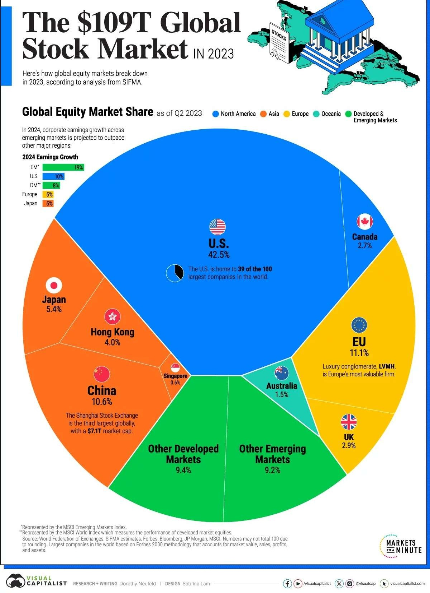
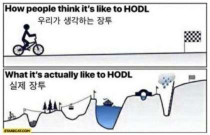
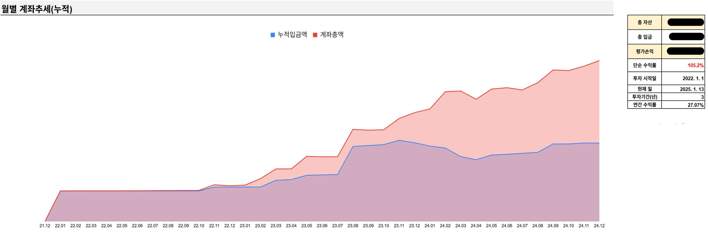
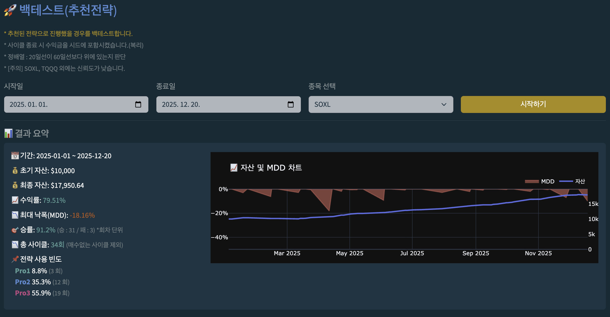
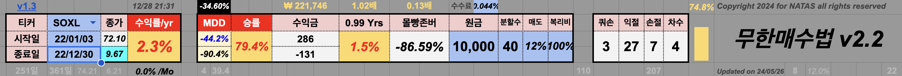
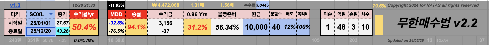

# 떨사오팔 Pro 투자 전략 가이드 (초보자용)

> 투자 기초부터 실전 전략까지, 처음 시작하는 분을 위한 완벽 가이드

---

# Part 1. 투자 기초

## 1. 왜 투자해야 하는가?

### 투자의 목적

우리가 투자를 하는 이유는 다양합니다:

- **노후 대비**: 은퇴 후 20-30년을 준비해야 합니다
- **자녀 증여**: 자녀에게 자산을 물려주기 위해
- **목표 달성**: 집, 자동차 등 큰 지출을 위한 자금 마련

### 왜 지금 투자를 시작해야 하는가?

| 상황 | 설명 |
|------|------|
| 근로소득 기간 제한 | 대부분 10-20년 정도의 근로소득 기간이 남아있음 |
| 은퇴 후 긴 시간 | 소득 없이 20-30년을 살아야 함 |
| 낮은 은행 이자 | 3% 대의 은행 이자는 물가 상승률 따라가기도 벅참 |
| 주식 투자의 가능성 | 연 7-10% 수익을 낼 수 있다면 노후 대비 가능 |

---

## 2. 투자의 종류

크게 두 가지 주요 투자 방법이 있습니다:

| 투자 종류 | 장점 | 단점 |
|----------|------|------|
| **주식** | 유동성 높음, 소액 투자 가능 | 변동성 큼 |
| **부동산** | 안정적, 실물 자산 | 대규모 자금 필요, 유동성 낮음 |

이 가이드에서는 **주식 투자**, 그중에서도 **미국 ETF 투자**에 집중합니다.

---

## 3. 복리수익률에 대한 이해

### 복리란?

**복리**란 원금에 이자가 붙고, 그 이자에 다시 이자가 붙어서 시간이 지날수록 눈덩이처럼 돈이 불어나는 것입니다.

> **복리의 마법 (Snowball Effect)**
>
> 아인슈타인이 "세계 8대 불가사의"라고 칭한 복리 효과

### 복리 계산법

```
최종자산 = 원금 × (1 + 수익률)^투자기간
```

**예시**: 1,000만원을 연 10% 복리로 20년 투자하면?
- 1,000만원 × (1.10)^20 = **6,727만원**

### 72의 법칙

복리 수익률로 원금이 **2배**로 증가하기까지 걸리는 시간을 쉽게 구할 수 있는 법칙입니다.

```
원금 2배 시간(년) = 72 ÷ 연 수익률(%)
```

| 연 수익률 | 원금 2배까지 걸리는 시간 |
|----------|------------------------|
| 3% (은행 예금) | 24년 |
| 7% (보수적 투자) | 10.3년 |
| 10% (적극적 투자) | 7.2년 |
| 15% (공격적 투자) | 4.8년 |

**핵심 메시지**: 수익률이 조금만 높아져도 자산 증식 속도는 크게 빨라집니다.

---

## 4. 왜 미국 주식인가?

### 글로벌 주식 시장 현황



| 국가/지역 | 글로벌 시장 점유율 |
|----------|-------------------|
| **미국** | **42.5%** |
| EU | 11.1% |
| 중국 | 10.6% |
| 일본 | 5.4% |
| **한국** | **약 2%** |

### 미국 주식에 투자해야 하는 이유

1. **세계 최대 시장**: 전 세계 주식 시장의 40% 이상 차지
2. **글로벌 탑 기업**: Apple, Microsoft, Google, Amazon 등 대부분 미국 기업
3. **주주 친화적**: 배당, 자사주 매입 등 주주 환원 정책이 활발
4. **투명한 시장**: 규제와 감독이 잘 되어 있음

### 한국 주식 시장의 한계

- 세계에서 약 2% 정도만 차지
- 재벌, 기업 친화적이고 주주 친화적이지 않음
- 미국 시장에 비해 투자 난이도가 높음
- "코리아 디스카운트" 현상

---

## 5. ETF란?

### ETF 기초

**ETF (Exchange Traded Fund)**: 펀드의 일종으로, 일반 주식처럼 거래 가능한 상품

| 항목 | 일반 펀드 | ETF |
|------|----------|-----|
| 거래 방식 | 펀드사 통해 매매 | 주식처럼 실시간 거래 |
| 수수료 | 높음 (1-2%) | 낮음 (0.03-0.5%) |
| 최소 투자금 | 보통 높음 | 1주 단위 (소액 가능) |
| 투명성 | 낮음 | 높음 (구성종목 공개) |

### 개별 주식 vs ETF

| 항목 | 개별 주식 | ETF |
|------|----------|-----|
| **분산 투자** | 직접 여러 종목 매수 필요 | 1주만 사도 수십~수백 종목에 분산 |
| **기업 분석** | 재무제표, 실적 등 공부 필요 | 시장/섹터만 이해하면 됨 |
| **리스크** | 한 기업 망하면 큰 손실 | 일부 기업 망해도 영향 적음 |
| **수익 잠재력** | 대박 가능 (테슬라 10배 등) | 시장 평균 수익률 |

### 왜 ETF를 선택하는가?

**1. 분산 투자가 자동으로 된다**

SPY 1주를 사면 애플, 마이크로소프트, 아마존 등 500개 기업에 동시 투자하는 효과

**2. 개별 주식 공부가 필요 없다**

- 재무제표 분석? 필요 없음
- 실적 발표 체크? 필요 없음
- "이 기업이 앞으로 잘 될까?" 고민할 필요 없음

**3. 시장 전체에 투자할 수 있다**

개별 기업의 흥망성쇠와 관계없이 **미국 경제 전체의 성장**에 투자

> 워런 버핏도 일반인에게 S&P 500 인덱스 펀드를 추천합니다.
> "대부분의 투자자는 저비용 S&P 500 인덱스 펀드에 투자하는 것이 최선이다."

### 인덱스(패시브) ETF

시장 지수를 그대로 따라가는 ETF로, 펀드매니저가 적극적으로 운용하지 않아 **수수료가 매우 저렴**합니다.

### 미국 주요 ETF


| ETF | 추종 지수 | 특징 | 10년 수익률 |
|-----|----------|------|------------|
| **SPY** | S&P 500 | 미국 시가총액 상위 500개 기업 | 약 247% |
| **QQQ** | 나스닥 100 | 나스닥 상장 시가총액 상위 100개 기업 (기술주 중심) | 약 450% |
| **SCHD** | 배당 성장주 | 배당을 꾸준히 잘 주는 100개 기업 | 약 186% |

**결론**: 미국 인덱스 ETF에 장기 투자하면 연 7-15% 수익을 기대할 수 있습니다.

---

## 6. 레버리지 ETF란?

### 레버리지 ETF 기초

**레버리지 ETF**: 기초 지수의 일일 수익률을 2배, 3배로 추종하는 ETF

| ETF | 기초 지수 | 배율 | 특징 |
|-----|----------|------|------|
| **TQQQ** | QQQ (나스닥 100) | 3배 | 나스닥이 1% 오르면 TQQQ는 3% 상승 |
| **SOXL** | SOXX (반도체 지수) | 3배 | 반도체 지수가 1% 오르면 SOXL은 3% 상승 |
| **UPRO** | SPY (S&P 500) | 3배 | S&P가 1% 오르면 UPRO는 3% 상승 |

### 레버리지 ETF의 특징

**장점**

- 상승장에서 수익 극대화
- 소액으로 큰 효과

**단점**

- 하락장에서 손실도 3배
- 변동성 손실 (Volatility Decay)
- 장기 보유 시 복리 효과로 예상과 다른 결과

### 왜 레버리지 ETF를 사용하는가?

떨사오팔 Pro 전략은 **단기 스윙 트레이딩**입니다.

- 레버리지 ETF의 높은 변동성을 활용
- 짧은 기간 (1-2주) 내 수익 실현
- 장기 보유하지 않으므로 변동성 손실 최소화

---

## 7. 주식 투자의 이상과 현실

### 우리가 생각하는 장기투자 vs 실제 장기투자



**우리가 생각하는 장투**: 평탄한 길을 자전거로 달리는 것

**실제 장투**: 산을 넘고, 물을 건너고, 폭풍을 만나는 험난한 여정

> **핵심 메시지**
>
> 주가 변동에 일희일비하지 않는 **마인드셋**이 가장 중요합니다.

---

## 8. 주식 투자의 절대적인 제1원칙

### 미국 주식 시장은 장기적으로 우상향한다

1929년 대공황, 2000년 닷컴버블, 2008년 금융위기, 2020년 코로나...

수많은 위기가 있었지만, **장기적으로 미국 주식 시장은 항상 우상향**했습니다.

### 그 외의 투자 원칙들

| 원칙 | 설명 |
|------|------|
| **High Risk, High Return** | 높은 위험을 감수해야 높은 수익 가능 |
| **Low Risk, Low Return** | 낮은 위험은 낮은 수익 |
| **분산 투자** | 한 종목에 몰빵하지 말고 분산 |
| **개별주 대신 ETF** | 개별 종목 리스크를 피하고 ETF로 분산 |

---

## 9. 투자 성과

### 실제 투자 성과 (2022년 1월 ~ 2024년 12월)



| 항목 | 내용 |
|------|------|
| 투자 기간 | 3년 |
| 단순 수익률 | **105.2%** |
| 연간 수익률 | **27.07%** |

이 성과는 **무한매수법이나 떨사프로를 알기 전**, 지수 ETF(QQQ, SPY 등)에 투자한 결과입니다.
2023년 8월 이전에는 퇴직금을 예금에만 넣어두었다가, 본격적으로 미국 주식 투자를 시작했습니다.

참고로 2022년 1월 ~ 2024년 8월 동안 AMD에 재직하며 RSU(양도제한조건부주식)와 ESPP(우리사주매수제도)로 AMD 주식을 받았습니다.
내 돈이 거의 들어가지 않은 주식 덕분에 짧은 기간에 100%가 넘는 수익률을 달성할 수 있었습니다.

---

# Part 2. 떨사오팔 Pro 전략

## 1. 떨사오팔이란?

**떨어지면 사고, 오르면 판다**의 줄임말입니다.

주가가 하락할 때 분할 매수하고, 상승할 때 매도하는 단순하지만 효과적인 투자 전략입니다.

### 핵심 철학
> "손실을 줄이는 것이 수익보다 중요하다"

욕심을 부리지 않고, 작은 수익이라도 꾸준히 쌓아가는 것이 목표입니다.

---

## 2. 왜 SOXL인가?

떨사오팔 Pro는 **SOXL(Direxion Daily Semiconductor Bull 3X Shares)** 을 메인 투자 종목으로 사용합니다.

### SOXL이란?

- **기초 지수**: SOXX (필라델피아 반도체 지수)
- **레버리지**: 3배 (일일 수익률 기준)
- **구성 종목**: 엔비디아, AMD, 인텔, TSMC, 브로드컴 등 30개 반도체 기업

### 왜 반도체 섹터인가?

**1. AI 혁명의 핵심 인프라**

ChatGPT, 자율주행, 클라우드 등 모든 AI 기술은 반도체 위에서 돌아갑니다.
AI 시대가 지속되는 한 반도체 수요는 계속 증가합니다.

**2. 높은 변동성 = 떨사오팔 Pro에 최적**

| ETF | 일일 변동폭 (평균) | 떨사프로 적합도 |
|-----|------------------|----------------|
| SPY | 0.5~1% | ❌ 너무 낮음 |
| QQQ | 1~2% | △ 보통 |
| SOXL | 5~10% | ✅ 최적 |

떨사오팔 Pro는 **하락 시 매수, 상승 시 매도**하는 전략입니다.
변동성이 높을수록 매수/매도 기회가 많아져 수익 사이클이 빨라집니다.

**3. 장기 성장 잠재력**

반도체는 스마트폰, PC, 자동차, 가전제품 등 모든 전자기기에 필수입니다.
디지털화가 진행될수록 반도체 시장은 계속 성장합니다.

### 왜 3배 레버리지인가?

| 시나리오 | QQQ (1배) | TQQQ (3배) | SOXL (3배) |
|---------|----------|-----------|-----------|
| 기초지수 +5% | +5% | +15% | +15% |
| 기초지수 -5% | -5% | -15% | -15% |

- **장점**: 같은 자본으로 3배의 수익 잠재력
- **단점**: 손실도 3배 → **반드시 분할 매수 전략 필요**

> 레버리지 ETF를 단순 보유하면 변동성 손실로 장기 수익이 줄어듭니다.
> 하지만 떨사프로처럼 **단기 스윙 트레이딩**을 하면 높은 변동성을 오히려 수익으로 전환할 수 있습니다.

### SOXL 선택 시 주의사항

- 반도체 섹터 특성상 **사이클이 있음** (호황/불황 반복)
- 개별 기업 이슈(예: 엔비디아 실적)에 영향 받음
- TQQQ보다 변동성이 더 크므로 **심리적 준비 필요**

---

## 3. 기본 원리: 분할 투자

### 왜 분할 투자인가?

한 번에 전액 투자하면 타이밍을 잘못 잡았을 때 큰 손실을 볼 수 있습니다.
분할 투자는 이 위험을 줄여줍니다.

**예시: $10,000 투자 시**

| 방식 | 장점 | 단점 |
|------|------|------|
| 한 번에 전액 투자 | 상승 시 수익 극대화 | 하락 시 손실 극대화 |
| 6번에 나눠 투자 | 리스크 분산, 평균 단가 낮춤 | 상승 시 수익 제한 |

---

## 4. 투자 방법 상세 설명

### 4.1 사이클이란?

하나의 투자 사이클은 다음과 같이 진행됩니다:

| 단계 | 설명 |
|------|------|
| 1. 사이클 시작 | 전략 선택 (Pro1/Pro2/Pro3) |
| 2. 분할 매수 | 하락 시 티어별로 매수 |
| 3. 보유 | 매도 조건 대기 |
| 4. 보유 티어 전량 매도 | 상승 시 또는 손절일에 매도 |
| 5. 사이클 종료 | → 다음 사이클 시작 |

### 4.2 6분할 매수 방식

총 투자금을 6개의 **티어(Tier)** 로 나누고, 예비 티어를 포함하면 최대 7티어까지 사용합니다.

```
티어 1: 첫 번째 매수 (가장 작은 금액)
티어 2: 주가 하락 시 추가 매수
티어 3: 더 하락 시 추가 매수
티어 4: 더 하락 시 추가 매수
티어 5: 더 하락 시 추가 매수
티어 6: 마지막 추가 매수 (가장 큰 금액)
티어 7: 예비 티어 (티어 1~6 매수 후 남은 잔여 예수금)
```

**포인트**: 주가가 떨어질수록 더 많은 금액을 투자하여 평균 단가를 낮춥니다.

**예비 티어(7티어)란?**

정액 매수를 하지 않기 때문에 티어별 매수금액에 단수가 생깁니다.
예를 들어 $10,000 투자 시 실제 매수금액 합계가 $9,850이면 $150이 남습니다.
티어 1~6이 모두 체결된 상태(풀티어)에서 추가 하락 시, 이 잔여 예수금을 예비 티어로 사용합니다.

- **목적**: 손실 발생 시 시드 보완, MDD 감소

### 4.3 매수/매도 타이밍

| 행동 | 조건 |
|------|------|
| **매수** | 전일 종가 대비 일정 % 하락 시 (전략마다 다름) |
| **매도** | 전일 종가 대비 일정 % 상승 시 (전략마다 다름) |
| **손절** | 10~12일 연속 보유 시 (더 이상 기다리지 않음) |

### 4.4 주문 방식: LOC / MOC

이 전략은 **종가 기준**으로 매매합니다. 일반 매매는 **LOC 주문**, 손절은 **MOC 주문**을 사용합니다.

#### LOC (Limit On Close) - 일반 매수/매도

| 항목 | 설명 |
|------|------|
| **LOC란?** | Limit On Close, 장 마감 시 종가로 체결되는 **지정가** 주문 |
| **주문 시간** | 미국 15:50 ET 이전 (한국: 프리장 오후 5시/6시 이후 권장) |
| **체결 시점** | 미국 16:00 ET 장 마감 시 (한국: 새벽 5시/6시) |
| **체결 조건** | 매수: 종가 ≤ 지정가, 매도: 종가 ≥ 지정가 |
| **사용 시점** | 일반적인 분할 매수/매도 시 |

※ 한국 시간: 섬머타임 적용 시 앞의 시간, 미적용 시 뒤의 시간

#### MOC (Market On Close) - 손절 매도

| 항목 | 설명 |
|------|------|
| **MOC란?** | Market On Close, 장 마감 시 종가로 체결되는 **시장가** 주문 |
| **주문 시간** | 미국 15:50 ET 이전 (한국: 프리장 오후 5시/6시 이후 권장) |
| **체결 시점** | 미국 16:00 ET 장 마감 시 **무조건 체결** (한국: 새벽 5시/6시) |
| **사용 시점** | 손절일(10~12일)에 보유 물량 전량 매도 시 |

**왜 손절일에는 MOC인가요?**

- LOC는 지정가이므로 종가가 지정가에 못 미치면 미체결됩니다.
- 손절일에는 **반드시 팔아야** 하므로 시장가인 MOC를 사용합니다.
- 손실이 나더라도 확실하게 청산하는 것이 전략의 핵심입니다.

```
📌 매매 흐름 예시:
1. 장 마감 전에 전일 종가 대비 등락률 확인
2. 매수/매도 조건 충족 시 LOC 주문 설정
3. 손절일이면 MOC 주문으로 보유 티어 전량 매도
4. 장 마감 시 종가로 자동 체결
```

---

## 5. 3가지 전략 비교

### Pro1: 보수적 전략 (안전 추구형)

| 항목 | 내용 |
|------|------|
| **분할 비율** | 5% → 10% → 15% → 20% → 25% → 25% |
| **매수 기준** | 전일 대비 -0.01% (아주 조금만 떨어져도 매수) |
| **매도 기준** | 전일 대비 +0.01% (아주 조금만 올라도 매도) |
| **손절일** | 10일 |
| **특징** | 최대 손실(MDD)이 낮음, 빠른 회전 |

**추천 대상**: 손실에 민감한 투자자, 안정적인 수익 선호

---

### Pro2: 균형형 전략 (가장 많이 사용)

| 항목 | 내용 |
|------|------|
| **분할 비율** | 10% → 15% → 20% → 25% → 20% → 10% |
| **매수 기준** | 전일 대비 -0.01% |
| **매도 기준** | 전일 대비 +1.50% |
| **손절일** | 10일 |
| **특징** | 효율적, 백테스트 결과 가장 균형 잡힘 |

**추천 대상**: 대부분의 투자자, 처음 시작하는 분

---

### Pro3: 공격적 전략 (수익 극대화형)

| 항목 | 내용 |
|------|------|
| **분할 비율** | 16.7% × 6회 (균등 분할) |
| **매수 기준** | 전일 대비 -0.10% |
| **매도 기준** | 전일 대비 +2.00% |
| **손절일** | 12일 |
| **특징** | 수익 극대화, 높은 변동성 감수 |

**추천 대상**: 위험을 감수할 수 있는 투자자, 공격적 투자 성향

---

### 2025년 백테스트 결과 (SOXL 기준)

> **백테스트(Backtest)** 란 과거의 주가 데이터를 사용해 특정 투자 전략의 수익성을 검증하는 방법입니다. "만약 이 전략으로 과거에 투자했다면 어떤 결과가 나왔을까?"를 시뮬레이션하는 것입니다.

#### 전략별 개별 성과


**기간**: 2025-01-02 ~ 2025-12-19 (YTD)
**초기 투자금**: $10,000

| 전략 | 최종 자산 | 수익률 | 최대 낙폭(MDD) | 특징 |
|------|----------|--------|---------------|------|
| **Pro1** | $13,472 | 34.72% | -18.7% | MDD가 가장 낮음 |
| **Pro2** | $13,029 | 30.29% | -38.3% | 중간 수준 |
| **Pro3** | $14,120 | 41.2% | -44.4% | 수익률 최고, MDD도 최고 |

---

#### 추천 전략 성과 (Pro1/2/3 동적 전환)



시장 상황에 따라 Pro1, Pro2, Pro3 전략을 동적으로 전환했을 때의 성과입니다.

**기간**: 2025-01-01 ~ 2025-12-20 (YTD)

| 항목 | 결과 |
|------|------|
| **초기 자산** | $10,000 |
| **최종 자산** | $17,950.64 |
| **수익률** | **79.51%** |
| **최대 낙폭(MDD)** | -18.16% |
| **승률** | 91.2% (31승 / 3패) |
| **총 사이클** | 34회 |

**전략 사용 빈도**

- Pro1: 8.8% (3회) - 시장 불안정 시
- Pro2: 35.3% (12회) - 일반적인 상황
- Pro3: 55.9% (19회) - 상승장 시

**추천 전략의 장점**

- 개별 전략 대비 **약 2배 높은 수익률** (79.51% vs 30~41%)
- Pro1 수준의 **낮은 MDD** (-18.16%)
- 시장 상황에 맞는 전략 자동 추천

---

### 무한매수법 v2.2와의 비교

떨사오팔 Pro와 무한매수법 v2.2를 동일 기간, 동일 종목(SOXL)으로 백테스트한 결과입니다.

#### 2022년 하락장 비교 (22/01/03 ~ 22/12/30)

2022년은 미국 금리 인상으로 SOXL이 **-86.59%** 폭락한 극심한 하락장이었습니다.

**무한매수법 v2.2 백테스트 (2022년)**


**떨사오팔 Pro 백테스트 (2022년)**


| 항목 | 무한매수법 v2.2 | 떨사오팔 Pro | SOXL 단순보유 |
|------|---------------|-------------|--------------|
| **수익률** | 1.5% | **44.3%** | -86.59% |
| **MDD** | -44.2% | **-20.78%** | -90.4% |
| **승률** | 79.4% | **88.9%** | - |

> 떨사오팔 Pro는 하락장에서 **수익률 약 30배 차이**, **MDD 절반 수준**으로 압도적 우위

#### 2025년 비교 (25/01/01 ~ 25/12/20)

**무한매수법 v2.2 백테스트 (2025년)**


| 항목 | 무한매수법 v2.2 | 떨사오팔 Pro | SOXL 단순보유 |
|------|---------------|-------------|--------------|
| **수익률** | 31.2% | **79.51%** | 56.34% |
| **MDD** | -32.8% | **-18.16%** | -76.5% |
| **승률** | 94.1% | 91.2% | - |

> 상승장에서도 **수익률 약 2.5배**, **MDD 절반 수준** 유지

#### 전략 구조 비교

| 항목 | 무한매수법 v2.2 | 떨사오팔 Pro |
|------|---------------|-------------|
| **분할 횟수** | 40분할 | 6분할 |
| **계산 복잡도** | T, 별퍼센트(10-T/2) 매일 계산 | 티어별 고정 비율 |
| **손절** | 쿼터손절 모드 (복잡) | 10-12일 명확한 손절 |
| **전략 선택** | 단일 전략 | 시장상황별 Pro1/2/3 |

#### 결론

> **"같은 기간, 같은 종목인데 수익률은 높고 MDD는 낮다"**

- **하락장 방어력**: 2022년 MDD -20.78% vs -44.2%
- **수익률**: 하락장/상승장 모두 우위
- **단순함**: 40분할 → 6분할, 계산 불필요
- **적응력**: 시장 상황에 맞는 전략 자동 추천

---

## 6. 실제 투자 예시

### 시나리오: Pro2 전략으로 $10,000 투자

**투자 종목**: SOXL (미국 반도체 3배 레버리지 ETF)
**총 투자금**: $10,000
**선택 전략**: Pro2 (균형형)

#### Pro2 전략 티어별 투자금

| 티어 | 비율 | 투자금 |
|------|------|--------|
| 티어 1 | 10% | $1,000 |
| 티어 2 | 15% | $1,500 |
| 티어 3 | 20% | $2,000 |
| 티어 4 | 25% | $2,500 |
| 티어 5 | 20% | $2,000 |
| 티어 6 | 10% | $1,000 |
| **합계** | 100% | **$10,000** |

---

### 📅 Day 1 (월요일) - 사이클 시작, 티어 1 매수

| 항목 | 내용 |
|------|------|
| 전일 종가 | $25.00 |
| **LOC 매수 주문** | 지정가: $25.00 × 0.9999 = $24.9975 → 버림 → **$24.99**, 수량: $1,000 ÷ $24.99 = **40주** |
| 당일 종가 | $24.85 (-0.6%) |
| **체결 여부** | 당일 종가 $24.85 ≤ 지정가 $24.99 → ✅ **체결** |

```
💰 티어 1 체결: 40주 × $24.85 = $994.00
📊 현재 보유: 40주 (평균단가 $24.85)
💵 남은 현금: $9,006.00 ($10,000 - $994)
```

**LOC 주문의 핵심**

- 주문 시점에는 당일 종가를 모릅니다.
- 전일 종가 기준으로 지정가($24.99)와 수량(40주)을 미리 계산해서 주문합니다.
- 지정가는 소수점 둘째자리까지 버림 처리합니다.
- 장 마감 후 당일 종가($24.85)가 지정가 이하이면 체결됩니다.
- 실제 체결 가격은 당일 종가($24.85)입니다.

---

### 📅 Day 2 (화요일) - 상승, 매매 없음

| 항목 | 내용 |
|------|------|
| 전일 종가 | $24.85 |
| **LOC 매수 주문** | 티어2: $24.85 × 0.9999 → **$24.84**, 수량: $1,500 ÷ $24.84 = 60주 |
| **LOC 매도 주문** | 티어1: $24.85 × 1.015 → **$25.22**, 40주 |
| 당일 종가 | $25.10 (+1.0%) |
| **체결 여부** | 매수: $25.10 > $24.84 → ❌, 매도: $25.10 < $25.22 → ❌ |

```
⏸️ 매수도 매도도 체결되지 않음
📊 현재 보유: 40주 (평균단가 $24.85)
💵 남은 현금: $9,006.00
```

**왜 체결이 안 되나요?**

- 매수: 당일 종가($25.10)가 지정가($24.84)보다 높아서 미체결
- 매도: 당일 종가($25.10)가 지정가($25.22)보다 낮아서 미체결
- 이런 날은 아무 일도 일어나지 않습니다.

---

### 📅 Day 3 (수요일) - 하락, 티어 2 매수

| 항목 | 내용 |
|------|------|
| 전일 종가 | $25.10 |
| **LOC 매수 주문** | 티어2: $25.10 × 0.9999 → **$25.09**, 수량: $1,500 ÷ $25.09 = **59주** |
| **LOC 매도 주문** | 티어1: $24.85 × 1.015 → **$25.22**, 40주 |
| 당일 종가 | $24.50 (-2.4%) |
| **체결 여부** | 매수: $24.50 ≤ $25.09 → ✅, 매도: $24.50 < $25.22 → ❌ |

```
💰 티어 2 체결: 59주 × $24.50 = $1,445.50
📊 현재 보유: 99주 (평균단가 $24.64)
💵 남은 현금: $7,560.50
```

---

### 📅 Day 4 (목요일) - 보합, 매매 없음

| 항목 | 내용 |
|------|------|
| 전일 종가 | $24.50 |
| **LOC 매수 주문** | 티어3: $24.50 × 0.9999 → **$24.49**, 수량: $2,000 ÷ $24.49 = 81주 |
| **LOC 매도 주문** | 티어1: $24.85 × 1.015 → $25.22 (40주), 티어2: $24.50 × 1.015 → $24.86 (59주) |
| 당일 종가 | $24.52 (+0.1%) |
| **체결 여부** | 매수: $24.52 > $24.49 → ❌, 매도: 모두 미충족 → ❌ |

```
⏸️ 주가가 거의 그대로 → 모두 미체결
📊 현재 보유: 99주 (평균단가 $24.64)
💵 남은 현금: $7,560.50
```

---

### 📅 Day 5 (금요일) - 급락, 티어 3 매수

| 항목 | 내용 |
|------|------|
| 전일 종가 | $24.52 |
| **LOC 매수 주문** | 티어3: $24.52 × 0.9999 → **$24.51**, 수량: $2,000 ÷ $24.51 = **81주** |
| **LOC 매도 주문** | 티어1: $24.85 × 1.015 → $25.22 (40주), 티어2: $24.50 × 1.015 → $24.86 (59주) |
| 당일 종가 | $23.80 (-2.9%) |
| **체결 여부** | 매수 티어3: $23.80 ≤ $24.51 → ✅, 매도: 모두 미충족 → ❌ |

```
💰 티어 3 체결: 81주 × $23.80 = $1,927.80
📊 현재 보유: 180주 (평균단가 $24.26)
💵 남은 현금: $5,632.70
```

**포인트**: 주가가 떨어질수록 더 많은 금액($2,000)을 투자해서 평균 단가를 $24.64 → $24.26으로 낮췄습니다!

---

### 📅 Day 6 (월요일) - 반등, 티어 3 매도

| 항목 | 내용 |
|------|------|
| 전일 종가 | $23.80 |
| **LOC 매수 주문** | 티어4: $23.80 × 0.9999 → **$23.79**, 수량: $2,500 ÷ $23.79 = **105주** |
| **LOC 매도 주문** | 티어1: $24.85 × 1.015 → $25.22 (40주), 티어2: $24.50 × 1.015 → $24.86 (59주), 티어3: $23.80 × 1.015 → **$24.15** (81주) |
| 당일 종가 | $24.50 (+2.9%) |
| **체결 여부** | 매수: $24.50 > $23.79 → ❌, 매도 티어1: $24.50 < $25.22 → ❌, 티어2: $24.50 < $24.86 → ❌, 티어3: $24.50 ≥ $24.15 → ✅ |

```
💸 티어 3 매도: 81주 × $24.50 = $1,984.50
   (매수 $1,927.80 → 매도 $1,984.50 = 수익 +$56.70)
📊 현재 보유: 99주 (티어1: 40주, 티어2: 59주)
💵 현금: $5,632.70 + $1,984.50 = $7,617.20
```

**매도 지정가 계산의 핵심**

- 매도 지정가는 **해당 티어의 매수 체결가** 기준으로 계산합니다.
- 티어 3 매수 체결가 $23.80 × 1.015 = $24.15

---

### 📅 Day 7 (화요일) - 상승, 티어 1+2 매도 → 사이클 종료!

| 항목 | 내용 |
|------|------|
| 전일 종가 | $24.50 |
| **LOC 매수 주문** | 티어4: $24.50 × 0.9999 → **$24.49**, 수량: $2,500 ÷ $24.49 = **102주** |
| **LOC 매도 주문** | 티어1: $24.85 × 1.015 → $25.22 (40주), 티어2: $24.50 × 1.015 → $24.86 (59주) |
| 당일 종가 | $25.30 (+3.3%) |
| **체결 여부** | 매수: $25.30 > $24.49 → ❌, 매도 티어1: $25.30 ≥ $25.22 → ✅, 티어2: $25.30 ≥ $24.86 → ✅ |

```
💸 티어 1 매도: 40주 × $25.30 = $1,012.00
   (매수 $994.00 → 매도 $1,012.00 = 수익 +$18.00)
💸 티어 2 매도: 59주 × $25.30 = $1,492.70
   (매수 $1,445.50 → 매도 $1,492.70 = 수익 +$47.20)
📊 현재 보유: 0주
💵 최종 현금: $7,617.20 + $1,012.00 + $1,492.70 = $10,121.90
```

**왜 티어 4 매수가 체결되지 않았나요?**

- 티어4 매수 지정가: $24.49
- 당일 종가: $25.30
- 당일 종가($25.30)가 지정가($24.49)보다 높아서 미체결
- 주가가 계속 상승해서 티어 4~6은 사용하지 않고 사이클 종료!

---

### 📊 사이클 결과 요약

#### 거래 내역

| 티어 | LOC 매수 지정가 | 체결가(매수) | 수량 | 매수금액 | LOC 매도 지정가 | 체결가(매도) | 매도금액 | 손익 |
|------|----------------|-------------|------|----------|----------------|-------------|----------|------|
| 티어 1 | $24.99 | $24.85 | 40주 | $994.00 | $25.22 | $25.30 | $1,012.00 | **+$18.00** |
| 티어 2 | $25.09 | $24.50 | 59주 | $1,445.50 | $24.86 | $25.30 | $1,492.70 | **+$47.20** |
| 티어 3 | $24.51 | $23.80 | 81주 | $1,927.80 | $24.15 | $24.50 | $1,984.50 | **+$56.70** |
| 티어 4~6 | - | 미체결 | - | - | - | - | - | - |
| **합계** | - | - | **180주** | **$4,367.30** | - | - | **$4,489.20** | **+$121.90** |

#### 최종 결과

```
📈 투자 원금: $10,000
📈 사용한 금액: $4,367.30 (티어 1~3)
📈 미사용 금액: $5,632.70 (티어 4~6)
📈 회수 금액: $4,489.20
📈 순수익: +$121.90
📈 수익률: +2.79% (사용 금액 대비)

✅ 사이클 소요 기간: 7일 (영업일 기준)
✅ 총 거래 횟수: 매수 3회, 매도 3회
```

---

### 💡 이 예시에서 배울 점

1. **LOC 주문은 전일 종가 기준으로 미리 계산**
   주문 시점에는 당일 종가를 모르므로, 전일 종가로 지정가와 수량을 계산합니다.
   지정가는 소수점 둘째자리까지 버림 처리합니다.

2. **체결 가격은 당일 종가**
   LOC 주문이 체결되면 실제 체결 가격은 당일 종가입니다.

3. **매도 지정가는 매수 체결가 기준**
   각 티어의 매도 지정가는 해당 티어의 매수 체결가 × 1.015로 계산합니다.

4. **매매 없는 날이 있다**
   Day 2, 4처럼 매수/매도 조건을 모두 충족하지 않으면 체결되지 않습니다.

5. **모든 티어를 사용하지 않을 수도 있다**
   이번 사이클에서는 주가가 상승해서 티어 4~6을 사용하지 않았습니다.
   티어 4 매수 지정가($24.49)보다 당일 종가($25.30)가 높아서 미체결.

6. **기계적으로 실행**
   "더 오를 것 같은데..." 하는 감정을 배제하고 규칙대로만 매매.

---

## 7. 운영 규칙 요약

### 반드시 지켜야 할 원칙

| 규칙 | 설명 |
|------|------|
| **시드 고정** | 사이클 진행 중에는 투자금 변경 금지 (단리 전략) |
| **손절일 준수** | 10~12일 지나면 손실이라도 정리 |
| **매일 확인** | 주문표대로 기계적으로 매매 |
| **감정 배제** | "더 오를 것 같다"는 생각 금지 |

### 자주 하는 실수

- 손절일에 "조금만 더 기다리자" → ❌
- 수익 나니까 "더 먹자" → ❌
- 급락에 겁먹고 매수 안 함 → ❌

---

## 8. 주의사항

### 투자 대상
- 이 전략은 **SOXL(미국 반도체 3배 레버리지 ETF)** 기준으로 설계되었습니다.
- 다른 종목에 적용 시 백테스트 결과가 다를 수 있습니다.

### 면책사항
- 백테스트 결과는 **과거 데이터 기반**이며, 미래 성과를 보장하지 않습니다.
- 모든 투자 결정과 그에 따른 책임은 본인에게 있습니다.

---

## 9. 시작하기

1. [떨사오팔 Pro 레이더](https://radar0458.pro) 사이트 접속
2. 현재 추천 전략 확인
3. 본인 성향에 맞는 전략 선택 (처음이면 Pro2 추천)
4. 매일 주문표 확인 후 매매 실행
5. 사이클 종료 시 다음 전략 재확인

---

## 10. 일일 루틴

매일 반복하는 투자 루틴입니다.

1. **매수/매도 현황 확인**
   - [떨사오팔 Pro 레이더](https://radar0458.pro) 사이트에서 어제 진행된 매수, 매도 현황 확인

2. **예수금 확인 (장중)**
   - 하루치 달러 매수액이 예수금에 있는지 확인
   - 모자랄 경우 달러 예수금 마련

3. **주문 입력 (저녁 6시 이후)**
   - 프리장 개장 이후 당일 매수, 매도 주문 걸기
   - 주문표대로 기계적으로 실행

---

## 11. 용어 정리

| 용어 | 의미 |
|------|------|
| **티어(Tier)** | 분할 매수 단계 (1~6단계) |
| **사이클** | 매수 시작부터 전량 매도까지의 한 주기 |
| **백테스트** | 과거 데이터로 투자 전략의 수익성을 검증하는 방법 |
| **MDD** | Maximum Drawdown, 최대 손실폭 |
| **손절** | 손실을 감수하고 매도하는 것 |
| **단리** | 원금만으로 투자 (수익을 재투자하지 않음) |
| **복리** | 수익을 재투자하여 이자에 이자가 붙는 것 |
| **ETF** | Exchange Traded Fund, 상장지수펀드 |
| **레버리지** | 지수 변동률의 배수로 움직이는 상품 |
| **LOC** | Limit On Close, 종가 지정가 주문 |
| **MOC** | Market On Close, 종가 시장가 주문 |

---

*마지막 업데이트: 2025년 12월*
